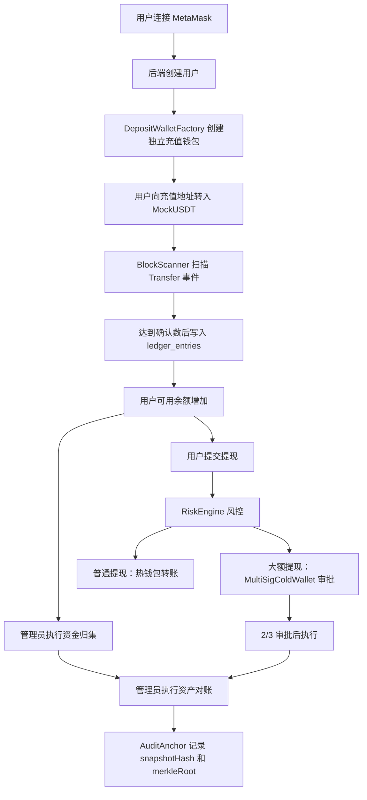

# 选题二：交易所钱包系统 DApp 开发

## 摘要

本项目实现一套基于以太坊测试链的交易所钱包系统 DApp，用于模拟数字资产交易所中的充值地址分配、链上充值监听、确认数入账、热冷钱包隔离、资金归集、提现风控、大额提现多签审批、本地资产账本、链上余额对账和储备金证明。系统采用三层架构：智能合约层使用 Solidity、Foundry 和 Anvil；后端服务使用 Node.js、TypeScript、Express、Prisma 和 SQLite；前端使用 Next.js App Router、TypeScript、wagmi 和 MetaMask。项目使用 MockUSDT 作为测试资产，不接入真实主网资产。

关键词：以太坊；交易所钱包；DApp；多签；Proof of Reserve；区块扫描

## 1. 需求分析

课程选题要求实现交易所钱包系统 DApp，而不是普通充值提现页面。系统需要同时覆盖用户端和管理员端，能够在本地 Anvil 链完整演示真实链上交易与链下账本配合的业务闭环。

核心需求包括：为每个用户分配独立充值地址；监听 MockUSDT 链上充值事件；按确认数完成入账；管理员可以将充值钱包资金归集到热钱包；普通提现由热钱包执行；黑名单、余额不足、提现频率、日限额和大额提现需要被风控处理；大额提现必须进入链上多签冷钱包审批；本地账本必须记录每一次资产变化；管理员可以执行本地负债与链上储备的对账，并将 snapshotHash 和 Merkle Root 写入链上审计合约；用户可以查询自己的 Proof of Reserve。

项目边界为课程演示系统，不实现交易撮合、订单簿、KYC、真实托管、真实主网资产处理。

## 2. 总体设计

系统采用前端、后端、智能合约和 SQLite 数据库协作的结构。前端负责钱包连接、页面展示、表单输入和操作状态展示；后端负责业务规则、风控、账本、区块扫描、交易广播、对账和 API；智能合约负责链上资产流转、独立充值钱包创建、多签审批执行和审计锚定；数据库保存用户、充值地址、充值记录、提现记录、账本流水、风控事件、扫描状态、对账报告和多签审批记录。

整体流程如下：

## 3. 详细设计

### 3.1 智能合约

| 合约 | 功能 |
|---|---|
| `MockUSDT.sol` | 测试 ERC20 代币，支持 owner mint，用于 Faucet 和本地演示。 |
| `DepositWallet.sol` | 用户独立充值钱包，只允许工厂合约触发归集。 |
| `DepositWalletFactory.sol` | 为用户 `userIdHash` 创建独立充值地址，保存映射并提供受限归集入口。 |
| `MultiSigColdWallet.sol` | 大额提现多签冷钱包，支持提交、审批、执行，防止重复审批和重复执行。 |
| `AuditAnchor.sol` | 保存对账 `snapshotHash`、`merkleRoot` 和报告 URI，防重复锚定。 |

### 3.2 后端模块

后端按 `router -> service -> repository -> schema` 分层。Router 只负责 HTTP 输入输出和 schema 校验；Service 负责事务、业务编排和链上交易；Repository 只负责 Prisma 数据访问；Jobs 调用 Service 复用扫描、确认、归集和对账逻辑。

主要服务包括：

- `UserService`：创建用户、调用工厂合约创建充值钱包、查询资产和充值地址。
- `DepositService`：扫描 MockUSDT `Transfer` 事件、按唯一键幂等入库、确认数入账。
- `WithdrawalService`：提现申请、冻结余额、普通提现广播、大额提现提交多签。
- `RiskEngineService`：黑名单、余额、频率、日限额、大额阈值判断。
- `MultisigService`：管理员审批和执行大额提现。
- `SweepService`：归集充值钱包余额到热钱包。
- `ReconciliationService`：统计本地负债和链上储备，生成 Merkle Root 和 snapshotHash，并调用 AuditAnchor。
- `OnchainEventService`：保存并查询关键链上事件。

数据库核心表包括 `users`、`deposit_addresses`、`deposits`、`ledger_entries`、`withdrawals`、`risk_events`、`blacklist_addresses`、`block_scan_state`、`reconciliation_reports`、`multisig_approvals`。

### 3.3 前端页面

用户端页面：

- 用户资产页：连接钱包、创建用户、展示资产。
- 充值页：展示充值地址、二维码、Faucet、扫描和确认按钮、充值历史。
- 提现页：提交提现申请，展示风控状态和 txHash。
- 历史页：展示充值和提现历史。
- Proof of Reserve 页：展示用户 Merkle Proof。

管理员端页面：

- 管理员看板：展示热钱包、冷钱包、充值钱包未归集余额、本地账本和风险统计。
- 资金归集：执行单地址或 ALL 归集。
- 风控黑名单：新增黑名单并查看风控事件。
- 多签审批：审批和执行大额提现。
- 资产对账：生成对账报告并上链。
- 链上数据中心：查询关键事件和区块扫描状态。

## 4. 程序运行结果测试与分析

测试记录见 `docs/test-report.md`。报告截图建议见 `docs/screenshot-checklist.md`。答辩时建议重点展示以下闭环：

1. 连接 MetaMask，创建用户并获得独立充值地址。
2. 用户转入 MockUSDT 后，扫描区块生成 `PENDING` 充值。
3. 达到确认数后执行确认入账，用户可用余额增加。
4. 管理员执行资金归集，链上出现 `Swept` 事件。
5. 普通提现成功并显示 txHash。
6. 黑名单地址提现被风控拒绝。
7. 大额提现进入多签，两个管理员通过 EIP-712 离线签名审批后执行。
8. 资产对账生成 Merkle Root 和 snapshotHash，并写入 AuditAnchor。
9. 链上数据中心展示关键事件。

## 5. 结论与心得

本项目的重点不是单一页面展示，而是将链上事件、链下账本和后台业务状态保持一致。实现过程中最关键的问题是幂等扫描、确认数入账、提现冻结与扣减、链上多签状态和本地提现状态的同步。通过统一金额格式、唯一事件键、Service 层事务、EIP-712 管理员离线签名和链上事件记录，可以降低重复入账、余额不一致、伪造审批和重复审批风险。

如果后续继续增强，可以增加自动定时扫描任务、区块重组回滚策略、前端交易状态轮询和更完整的权限认证。

## 参考文献

[1] Ethereum Foundation. Ethereum Developer Documentation. https://ethereum.org/developers/

[2] Foundry Book. https://book.getfoundry.sh/

[3] OpenZeppelin Contracts Documentation. https://docs.openzeppelin.com/contracts/

[4] Prisma Documentation. https://www.prisma.io/docs

[5] wagmi Documentation. https://wagmi.sh/
